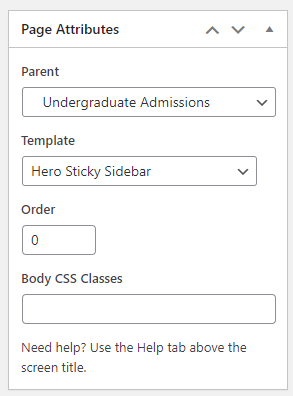
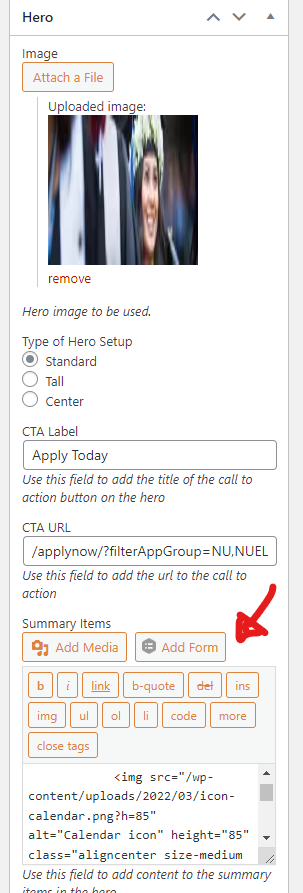

# Areas of Interest & Degree Landing Pages

- Create a new page and select the `Hero Sticky Sidebar` template from the `Page Attribute` metabox.

- The following section can be edited using the `Summary Items` custom field from the `Hero` metabox.

- The floating sidebar can be edited using a custom field with the name `sidebar_content` and add any HTML you need in the value field.

- For the Program Finder shortcode, please review [this page](https://nationaluniversitysystem.github.io/dev-knowledge-hub/#/nu-site-doc/program-finder).

- Here is an example: https://www.nu.edu/admissions/undergraduate/bachelors-degrees/
