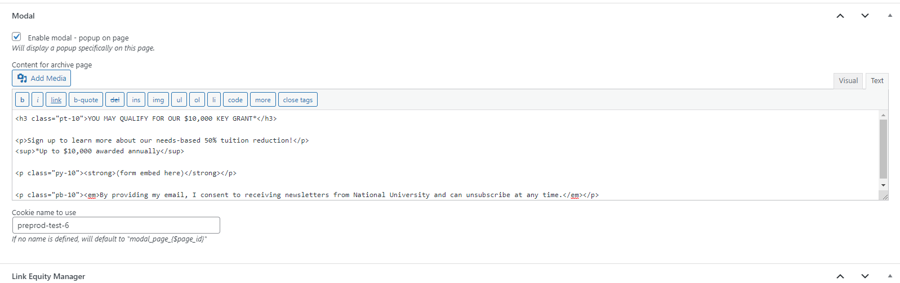

# Modal Popups

There are two types of modal functionality on the site: Global and single-page.

The Single-Page modal takes precedence (i.e. if there is a modal enabled for a specific page, that modal will display instead of the global one).

To configure a single-page modal, go into the content editor for that page. 

