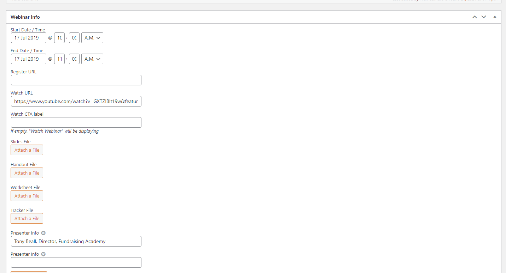
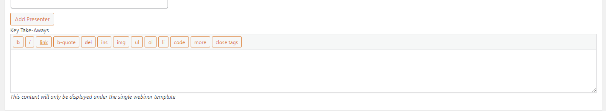
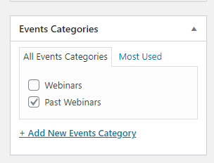

# Other Sites

Quick notes regarding content management for other sites we manage. For more in-depth information about the following sites, visit the [Other Sites Section](/other-sites/site-inventory.md).

## Fundraising Academy
https://www.fundraising-academy.org/
### Events ("Webinars")
- Events (Custom Post Types)
	- Fill out all the fields to create a new webinar that will be listed on the [Webinars page](https://www.fundraising-academy.org/training-education/webinars/).

- Webinars on this site will **automatically** be moved from the Upcoming Webinars section to the On-Demand section 24 hours after webinar start date.
- Before adding a presenter headshot, please make sure the image does not exist already on the Media Library.
- Headshot specs should be 300 x 300 pixels.
- If Key Takeaways bullet points are provided on the copy deck, please use the designated custom field for them:

- Key Takeaways section only needs to be displayed if a webinar is under the Upcoming Webinar section and on the `single-webinar.php` (e.g. [March 2022 webinar single event page](https://www.fundraising-academy.org/event/prospecting-hybrid-world/))

## Harmony SEL
https://www.harmonysel.org/
### Events ("Webinars")
- Webinars on this website work pretty much the same as they do for the [Fundraising Academy](/content-management/other-sites?id=fundraising-academy) site.

## Inspire
https://www.inspireteaching.org/
### Events ("Webinars")
!> **Important**: Events on Inspire **do not** automatically change from 'upcoming' to 'past' after the event date passes. When creating a new event for Inspire, add a reminder to your outlook calendar for the day after the event, so you can re-visit and manually change the event to 'past webinars'. **@TODO** find a way to automate this like we do on our other sites

- On this site, we use a plugin called [The Events Calendar](https://theeventscalendar.com/products/wordpress-events-calendar/) for anything related to events aka webinars.
- It's critical that you tag events specifically as a webinar or past webinars.
	- Webinars will be listed under the Upcoming Webinars section.
	- Past Webinars will be listed under the On-Demand Webinars section.

#### SEC Contact Info
- Account Director: Kirsten Hansen
- Client point-of-contact (Inspire): Amanda Rothengast
- Client point-of-contact (Harmony & Fundraising Academy): Pearl Hoeglund

## NUSystem.org
- Press Releases
	- Need to manually change 'author' after creating post.
	- Author should be `NUSystem`.

## info.nu.edu
- Some templates make heavy use of widget areas for content.

## brand.nu.edu
- Everything is currently hard-coded, due to site simplicity & tight deadline. We will revisit and 'wordpress-ify' it later, time permitting.

## Etc...
