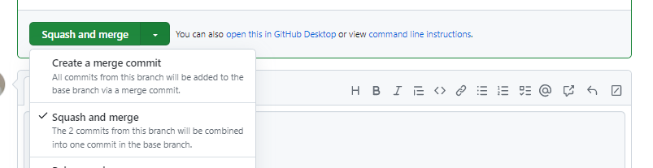

# Build Workflow

Basic Process:

1) Code pushed to "live" branch (develop, develop3, preprod, or master)
2) CircleCI runs the build process (generally takes a couple minutes)
3) If successful, CircleCI pushes all changes to the appropriate '-built' branch (develop-built, develop3-built, preprod-built, master-built)
4) WPVIP takes the code from the '-built' branch and deploys it to our live site (generally takes a couple minutes)
5) Caches will generally need to be cleared, including Cloudflare if applicable

## First environment: develop or develop3

Code changes are typically pushed directly to develop. However, Johnny uses develop3 for content updates, so for proofing purposes or for testing larger updates such as a WP Core update, we sometimes push to develop3 first until everything looks good, then also push to develop.

To merge to develop or develop3, a senior developer will first review the PR, then merge. To perform this merge, we either create a merge commit, or if there are a lot of commits and it makes more sense to combine them, squash and merge.

## Second environment: preprod

Preprod is our staging environment, where we test changes again and make sure everything looks good before going live. Changes pushed to this environment will automatically be included in any releases to prod.

## Final environment: prod

Changes to prod are typically merged either on Tuesdays or Thursdays. We coordinate with The Brick Factory to make sure everything in preprod is tested and ready to merge. See [Code Releases](https://nationaluniversitysystem.github.io/dev-knowledge-hub/#/dev-workflows/code-releases) for step-by-step details.

## CircleCI

We use a service called CircleCI to run our build & deploy process. This is necessary because we do not include asset files (i.e. final CSS & JS) in our git repos. In our local environments, we solve this by running `npm run gulp` -- for our live server environments CircleCI essentially does this for us.

CircleCI "watches" all of our "live" branches (i.e. preprod, develop, master) and runs the build process anytime there is a change to one of those branches in Github. It then runs the build process as configured in the `.circleci/config.yml` file.

When the build process is complete, CircleCI notifies our slack channel #nu-github. If there is a problem and the build process fails, it will notify the slack channel and also send you an email.

### Troubleshooting

CircleCI requires an active SSH key in order to authenticate with the GitHub of the repository it's building.

SSH keys will periodically need to be re-generated. There are 3 components to this: First, delete and re-generate from within CircleCI->Project Settings->SSH Keys. Second, delete and re-add to the relevant Github repo Deploy Keys. Third, update the codebase's .circleci/config.yml file to update the 'fingerprint' value provided by CircleCI.

## WPVIP

WPVIP is set to "watch" our '-built' branches, and deploy changes to our site whenvever there is a change to one of those branches.