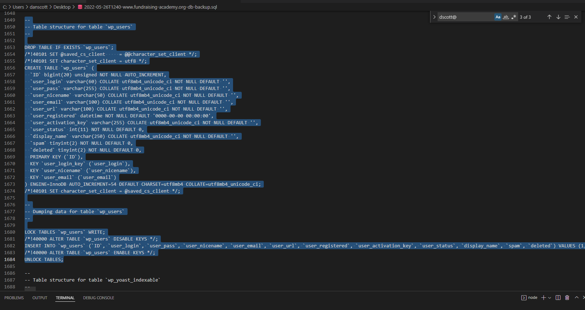
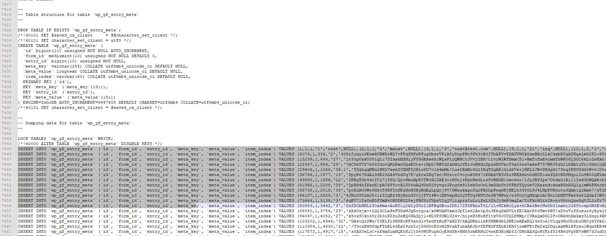

# Local Environment Setup

!> Important: *Most* of our live sites are setup as multisite installations. Even sites that don't actually have any subdomains are generally still installed as a multisite. This is often important to specify when setting up a local environment as there are some behind-the-scenes differences with how WordPress handles multisites. We don't want a situation where a new feature is developed locally, only to have it break when pushed live because of the multisite aspect.

----------------------------------------------------------------------

## WPVIP Local Dev Tool

WPVIP recommends setting up a local development environment with the VIP Local Development Environment feature built into VIP-CLI. This has the benefit of making it easy to create a local environment that is nearly identical to our live site. This environment is based on Docker; however, only minimal knowledge of Docker is actually required.

Please see [WPVIP - Create a VIP Local Development Environment](https://docs.wpvip.com/how-tos/local-development/use-the-vip-local-development-environment/) for WPVIP's official documentation. This tool is under constant development by WPVIP, so refer to that link for the most up-to-date info. That being said, WPVIP's documentation is not always clear, so the below is a walkthrough example to be used in conjunction with the official documentation.

### Below steps will focus on setting up a local environment for nu.edu. Most of our other sites will follow the same process.

1) Check all prerequisites required in the WPVIP documentation, i.e. VIP-CLI, Docker Desktop, etc.

2) Clone our site's [Github repo](https://github.com/wpcomvip/nu-edu) to your local computer. Ideally to your desktop or somewhere that is easy to access.
	- Note: You may need to configure your GitHub account with an SSH key, since our repos are private and live under the WPVIP parent account.

3) Via command line, run `vip @1161.production dev-env create --slug=nu-edu` to create your local dev environment.
	- This launches the WPVIP local dev env setup wizard.
	- `@1161.production` tells the tool we want to create a local environment that matches the **production** version of our nu-edu site (which is VIP app ID **1161**)
		- Running `vip app list` will give a list of all of our sites along with their VIP app ID #s
	- `--slug=nu-edu` tells the tool to give a certain name to your local environment. **You can name this anything you want**, but it's generally best to have it match with whatever we call it on WPVIP.
	- Multisite prompt: match the live setup. Usually true.
	- PHP version: match live setup. Usually 8.0.
	- WordPress version: match live setup. Usually 6.0.
	- Redirect to live site for media files -- true is recommended as it means you won't have to pull images locally
	- Source vip-go-mu-plugins -- image/demo (this is code that WPVIP runs on the back-end of all sites)
	- Source application code -- local/custom; paste the full folder path to the repo you cloned in Step 2
	- Enterprise Search -- false (I don't think we use this on any of our sites)
	- phpMyAdmin -- true is recommended but optional if you prefer to interact with the database some other way
	- XDebug -- false, @todo investigate incorporating this into our workflow (good way to debug PHP)
	- MailHog -- false, @todo investigate incorporating this into our workflow (catches all emails so you can see them locally without having to live-send)

4) Run `vip dev-env start --slug nu-edu` to launch the local environment you just created.
	- This may take few minutes to run, as it is spinning up a Docker container, pulling down WordPress, pulling down the vip-mu-plugins, and setting up the environment. 
	- In the future you can run the command with the `-S` flag to skip rebuilding, for a somewhat faster load time.

5) Import the database locally. [Please see the full WPVIP tutorial on this here](https://docs.wpvip.com/how-tos/dev-env-add-content/).
	- Export the most recent database backup from WPVIP dashboard (or VaultPress). Note that for nu.edu it will probably take awhile to 'prepare' the file for download, as the database is very large. Using a basic text editor such as Notepad++ (Windows) or BBEdit (Mac) is recommended - the file is large and tends to crash IDEs.
	- Unzip the downloaded .gzip file.
		- If using WPVIP Dashboard Database Export, export is a single .sql file that will have a timestamped name.
		- If using a VaultPress database export, each table is exported as its own file, and you need to concat them into a single file. Vaultpress also splits each multisite sub-site into its own separate export, so you will have to repeat the below process for each sub-site.
	- To make things easier in the CLI, rename to **nu-edu-db.sql**. For the import process, WPVIP says the file must be saved to the home directory of the current user (Windows: C:\Users\current-user\nu-edu-db.sql, Mac: /Users/current-user/nu-edu-db.sql)
	- Open the .sql file and **delete** the following:
		- Everything related to the `_pantheon_heartbeat` table - @todo remove from production
		- Everything related to the `wp_users` and `wp_usermeta` tables. We do this because WPVIP's dev-env tool creates a special "vipgo" user account for our local dev environment, and we don't want to overwrite that.

		- For nu.edu, we can also delete the **INSERT INTO** data for following tables: `wp_gf_entry_meta`, `wp_gf_entry`, `wp_gf_entry_notes`, `wp_2_gf_entry_meta`, `wp_2_gf_entry` and `wp_2_gf_entry_notes` tables. 
			- We **do not** want to delete the **CREATE TABLE...** portion of these tables. Otherwise GravityForms will be buggy on our local environment.
			- These tables store our historical gravity form submissions, for both www and info. We don't need these locally. @todo remove old data from production, preferably on a set schedule

		- Run `vip dev-env --slug=nu-edu import sql nu-edu-db.sql --search-replace="//www.nu.edu,//nu-edu.vipdev.lndo.site","//info.nu.edu,//info.nu-edu.vipdev.lndo.site","//india.nu.edu,//india.nu-edu.vipdev.lndo.site","//community.nu.edu,//community.nu-edu.vipdev.lndo.site","//saam.nu.edu,//saam.nu-edu.vipdev.lndo.site","//anniversary.nu.edu,//anniversary.nu-edu.vipdev.lndo.site","//law.nu.edu,//law.nu-edu.vipdev.lndo.site","https:,http:"`
			- This imports our database and changes the URL structures to match that of our local environment. **NOTE** If you chose a slug other than **nu-edu** for your local environment, you will have to change the URLs above to match that.
		- Once this is imported, there are still a handful of database changes we'll need to make. @todo automate these:
			- wp_options table: both `siteurl` and `home` should be `http://nu-edu.vipdev.lndo.site` (can do https if you have that configured for local)
			- wp_site table: `domain` should be `nu-edu.vipdev.lndo.site`
			- wp_sitemeta table: `site_name` should be `nu-edu.vipdev.lndo.site`
			- wp_blogs table: Ensure all `domain` values have the proper `nu-edu.vipdev.lndo.site` suffixes
			- wp_2_options: Ensure `siteurl` and `home` have the proper `nu-edu.vipdev.lndo.site` suffixes, and that `https://` is changed to `http://`
				- Repeat this for all wp_[#]_options tables
			- After updating, restart the vip dev-env environment

6) Visit your local URL admin: `nu-edu.vipdev.lndo.site/wp-admin` (or whatever URL what generated when you ran step #4 above)
	- Login username `vipgo` password `password`

7) Run `vip dev-env --slug=nu-edu exec -- wp super-admin add vipgo`
	- vipgo user is automatically a super-admin on single-site installs, but for multisite you need to manually add.
	- To verify this was successful, reload the wp-admin page. You should be able to see 'Plugins' on the menu, and the top admin bar under 'My Sites' should have a 'Network Admin' option.

8) Check that all network sites are present
	- WP-Admin->My Sites->Network Admin->Sites
	- For each site, ensure that you are able to:
		a) Visit the site. Make sure it loads **locally** and doesn't redirect to the live site. The styling will look completely off and that is okay, because we still need to build the theme assets (next step)
		b) Load the Dashboard for that individual site

9) Build theme assets
	- At this point, visiting your local site `http://nu-edu.vipdev.lndo.site/` will show the correct content, but the styling will probably be broken. That's because we still need to build our theme assets.
	- Navigate to `themes/national-university-hotb/` and run `npm install` and then `npm run gulp`
		- This will build our CSS & JS assets, which are in our `/themes/national-university-hotb/assets/` folder. This folder is excluded from git, as we use CircleCI for our build process on the live sites.
		- We currently use gulp for our build process here, which also launches its own localhost. Since we're running our local environment vai WPVIP/Docker, we can close this process once the file build is complete.
		- Gulp may throw a series of errors/warnings for jslint & sasslint. @todo revisit
		- After the command completes, run `vip dev-env --slug=nu-edu exec -- wp cache flush --all-tables` to flush the cache
	- Repeat this process for `themes/info-hotb`.
	- For `themes/info-parent`, run `npm install` followed by `npm run build`.
	- Repeat this process for the other themes in the themes folder if you want, but we rarely (if ever) make updates to those.
	- @todo Audit and fix packages with security vulnerabilities.

10) Build plugin assets
	- Similar to the above process, certain custom plugins require assets to be built as well.
		- plugins/gravityforms-nus-customization -- `npm run build`
		- plugins/national-university-react-wp-plugin -- `npm run build`
		- plugins/nuedu-blocks -- `npm run build`
		- plugins/nuedu-core-functionality -- `npm run build`
		- plugins/nus-react-wp -- `npm run build` @todo investigate the difference between this plugin and national-university-react-wp-plugin

	- After running all of these, it might not be necessary, but it's probably a good idea to restart your dev env.

11)  At this point, your local site should be *nearly* identical to the live site.
	- Certain images are going to be missing, and that's okay. During the `dev-env create` setup wizard, we had an option for `--media-redirect-domain`. This enables our local site to pull images from the live site, but it only works for images that are attached/loaded via wordpress (i.e. featured images, or anything loaded via wp_get_attachment, etc). Images that are hard-coded as HTML or manually set as background-image via CSS will usually not load locally. This could probably be fixed, but unless it is mission-critical for a specific dev task, it's probably not worth the effort. Note that you can still upload images to the local site via WP-Admin and they will be available to use as you would on the live site.

	- To stop your dev environment: `vip dev-env --slug=sip-org stop`
	- To restart your dev environment: `vip dev-env --slug=sip-org start`
	- To view all your available local dev environments: `vip dev-env list`
	- To view all vip dev env commands: `vip dev-env -h`

12) Additional steps/recommendations
	- **Required**: Install our [NU Code Standards Package](https://github.com/NationalUniversitySystem/nusa-code-standards) on your system.
		- This is important because, in addition to our own internal code standards, WPVIP enforces us to adhere to certain wordpress-specific standards.
		- After installing the packages from Github, install  the VSCode extension 'phpcs' -- this will enable VScode to show you errors/warnings in your code editor in real time.

	- **Recommended**: Go to Network Admin->Users and edit user for vipgo. Change your 'admin color scheme' to something other than default. That way it will always be obvious that you are currently on your local dev, rather than a live environment. Recommended to do this for preprod and develop environments too, so you never run the risk of accidentally editing something on the live site.

	- Optional: We previously used an [internal 'dev toolbox' plugin pack](https://github.com/NationalUniversitySystem/dev-toolbox) which could be added to your local environment to help with development & debugging. You can still do this if you want (follow the instructions in the repo's readme), however this repo is pretty outdated and *most* of these features have been directly integrated into WPVIP.

	


**Additional Notes for WPVIP Local Dev Environment:**
- Wordpress Debug Log: can be found at C:\Users\\[user]\\.local\share\vip\dev-environment\sip-org\log (windows specific)
- wp-config.php can be found at: C:\Users\\[user]\\.local\share\vip\dev-environment\sip-org\config (windows specific)
	- Certain sites/plugins might require certain 'development constants' to be set here, i.e. `define( 'JETPACK_DEV_DEBUG', true );` 

**Troubleshooting**

See [VIP's troubleshooting section](https://docs.wpvip.com/technical-references/vip-local-development-environment/troubleshooting-dev-env/) first.

## Port conflicts

One issue they don't cover well is resolving port conflicts. If you spin up a local environment and its URLs include port numbers - for example, http://nu-edu.vipdev.lndo.site/:8080 - that means VIP local was not able to use the default port 80. To find out what's using that port, you can use the command

`netstat -anv | grep 127.0.0.1.80`

This will give you a whole group of information about whatever is using port 80. Grab the third number after LISTEN, which is the process ID (PID), and then run

`ps -Ao user,pid,command | grep -v grep | grep PID`

(Just replace the all-caps PID at the end with the actual process ID, and leave the lowercase "pid" as-is.) This second command will give you the name of the process that is using port 80. From there, you'll need to find out where that software is installed or configured. If possible, uninstall the software. If that's not possible, configure it to use a different port number. If that's also not possible, the last resort is to manually edit your database settings to use whichever port VIP Local has assigned at the time. The tricky part is, each time you start the local environment, that port number changes, so you'll be frequently editing `siteurl` and `home` and any other applicable values for MultiSites.

## HTTPS links

If your browser throws an error due to links on the local site being HTTPS, and you don't have SSL set up on localhost, you can either:

- In the database `wp_options` table, make sure `option_name: siteurl` and `option_name: home` values are set to **http**://[url] instead of **https**://[url]
	- If you change this, need to navigate to WP Admin>Permalinks and click 'save changes' without actually changing anything. This will rewrite your permalinks to use HTTP.
- Or, [set up SSL on your localhost](https://docs.wpvip.com/how-tos/dev-env-advanced-usage/#h-add-a-trusted-ca-certificate).

--------------------------------------------------------------------------------

## VVV setup

> Old documentation below, might still work.

[WPVIP - Setup VVV for VIP Development](https://docs.wpvip.com/how-tos/local-development/set-up-vvv/)

Here are some helpful steps and info to import a WPVIP site's database (DB) into a local environment so that devs can work with data that is as close as possible to the live environment.

- Download database(s) from [VaultPress](https://dashboard.vaultpress.com/).
	- If you need to download a WP network/multisite install, VaultPress stores backups divided into one per site (i.e. each subdomain is its own backup).
	- Use the option to download the whole DB (all tables).
- Once downloaded, delete the `wp_users` table and Gravity Forms related tables, if present.
- Remove the **Jetpack** related rows from the `wp_options` table(s).
	- At the very least, `jetpack_options` row needs to be removed but it is heavily adviced to remove _all_ `jetpack` options and also all `vip` related ones.
- Combine all the tables into a single `.sql` file by running the following CLI command in the folder where all the files are.
	- If there was multiple sites (subdomains) downloaded, you will need one file per site. Recommendation is to name each file as the subdomain slug.
	- `cat *.sql > all_files.sql`
	- Tip: save the command as an `alias` for convenience and later use as `alias sqlall='cat *.sql > all_files.sql';`.
- Place the `all_files.sql` (or multisite names) file(s) itself into the root of your site (same level as the site's `wp-config.php` file).
- For importing the DB into your local environment there are a few methods:
	- **TablePlus** (or other DB management software)
		- While managing your local DB, find the **Import** option which will allow the use of a SQL dump file.
		- In [TablePlus](https://tableplus.com/) the option is under `File -> Import -> From SQL Dump...`
	- **Vagrant / VVV**
		- SSH into your vagrant server via `vagrant ssh`.
		- Navigate to the very top level of your VM: `cd ../..`.
		- CD into the site in question `cd srv/www/{site-setup-slug}/public_html`.
		- Use [WP-CLI](https://developer.wordpress.org/cli/commands/db/import/) to import the DB file `wp db import all_files.sql`. If there were multiple subdomains, this command will need to be used once per subdomain with the `--url` flag (e.g. `wp db import subdomain.sql --url=https://subdomain.nu.loc`).
		- Exit the VM/server `exit`.
- Using **WP-CLI**, Do a search and replace for the source environment URL.
	- This needs to be done while inside the Vagrant VM.
	- First a dry run to confirm there will be data replaced `wp search-replace old-site.com new-site.dev --dry-run`
	- Then run without the `--dry-run` flag.
	- If the import of a site that is part of a multisite installation, remember to use one of the following flags:
		- `--url=subdomain.url.tld` if the site being imported is _not_ the main top site (blog ID = 1).
		- `--network` if importing multiple sites and need to replace on all registered to `$wpdb`.
		- `--all-tables-with-prefix` flag for all the tables with the predefined prefix (usually `wp_`).
		- If all else fails, `--all-tables` for literally _all tables_ in the DB.
		- For more information, visit the [WP CLI docs](https://developer.wordpress.org/cli/commands/search-replace/).
- Some SQL queries and DB modifications need to be done on the local DB now.
	- Update the authors in _all_ your `wp_posts` tables (`wp_posts`, `wp_2_posts`, etc) `UPDATE wp_posts SET post_author = 1 WHERE post_author <> 1;`
	- If your local site setup is a multisite, the row where `meta_key` column is "site_admins" in the `wp_sitemeta` table will need to be updated to include your local username, or fully replaced. Use any online tool to unserialize the data (it is an array of user names), add your username or replace completely, and then serialize back to place in the corresponding `meta_value` column.
- Tip: At this point run `wp cache flush` while SSH'ed into the Vagrant VM and in the proper folder.
- Tip: VaultPress does not immediately provide a back up of the `uploads/` folder and therefore all media. To make things easier and not request a full backup of that folder from WPVIP, we use a custom option in **VVV** that will fetch the source environment's files if missing locally. Add the live URL to the vagrant custom option of your local setup and run `vagrant provision` command.
```yml
	custom:
	  live_url: https://production.com
```

Some of the above is taken from WPVIP's own guides:
- [WPVIP — Sites Content in Local Development](https://wpvip.com/documentation/vip-go/local-vip-go-development-environment/#using-the-sites-content-in-local-development).
- [WPVIP — Search & Replace (step 14 on page)](https://wpvip.com/documentation/vip-go/vip-go-local-setup-windows/).

Additional helpful links:
- [VVV — Setting Up HTTPS](https://varyingvagrantvagrants.org/docs/en-US/references/https/)
---

## Troubleshooting

### Fix ERR_TOO_MANY_REDIRECTS


1. Clear browser data (suggested time range: 24 hours).
1. Delete Cookies on that specific site where this issue is happening.
1. Flush DB cache:
	- `vagrant ssh`
	- Navigate to the very top level of your VM: `cd ../..`
	- Access the site where you are having the issue: `cd srv/www/{$site_slug}`
	- `wp cache flush`
1. Check HTTP to HTTPS Redirects on the following tables:
	- wp_options - `siteurl` & `home` (http should be included)
	- wp_site - domain (url without http)
	- wp_sitemeta - `siteurl` (http should be included)
1. Confirm local domain are correct on `wp_blogs` table.

Helpful links:
- [How to Fix ERR_TOO_MANY_REDIRECTS on Your WordPress Site](https://kinsta.com/blog/err_too_many_redirects/)
- [How to Fix err_too_many_redirects in WordPress](https://www.hostinger.com/tutorials/how-to-fix-err-too-many-redirects#1-Deleting-Browser-Data)

### Fix redirect to the production environment
An issue you might run into when importing a site from production (or any other environment) to your local, is the your local URL redirecting to the source environment URL. To fix this try the following in Google Chrome:
- Open a new tab (_not_ in incognito mode).
- Open the dev console before doing going to any URL.
- Under the **Network** tab, make sure the "disable cache" option is checked.
- Go to your local environment's admin URL `{local-url.loc/wp-admin/}`.
- If this does not redirect, log in.
- Navigate to the Settings -> Permalinks settings page.
- Save/update settings without actually changing anything.

Although the root folder has composer.json, don't run composer install. Only for when updating specific plugins or installing new plugins.