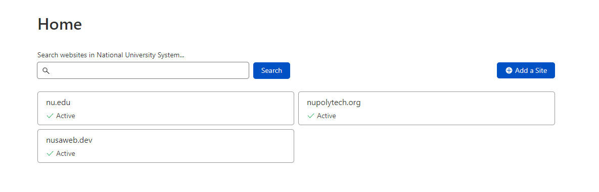
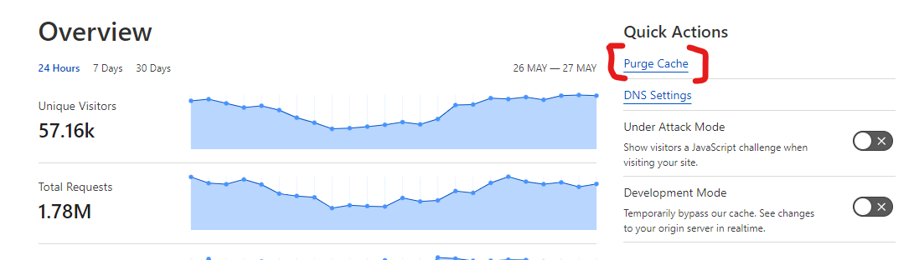
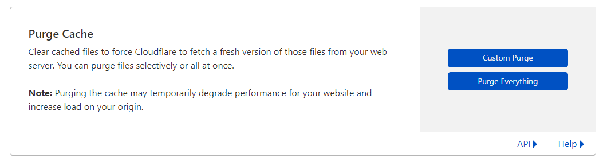
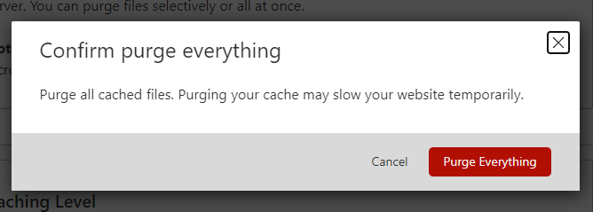

# Cloudflare

Once a code release for NU has been deployed, it's highly recommended to purge the cache in Cloudflare. To do so, you would need to follow the steps below:

- [Log in to Cloudflare](https://dash.cloudflare.com/login) and select the `nu.edu` site:

- Select `Purge Cache` from the **Quick Actions** menu

- Click `Purge Everything`

- And then confirm

