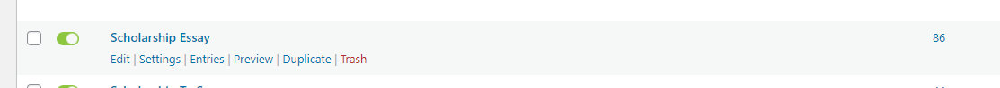
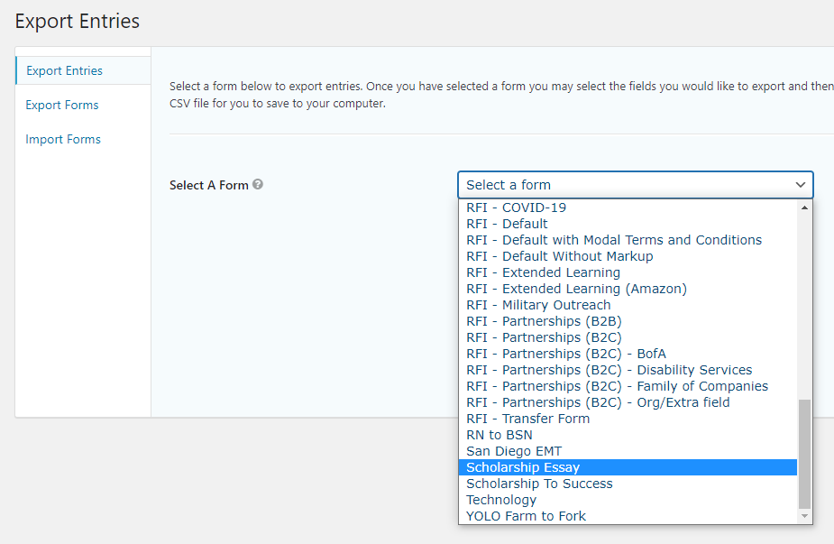
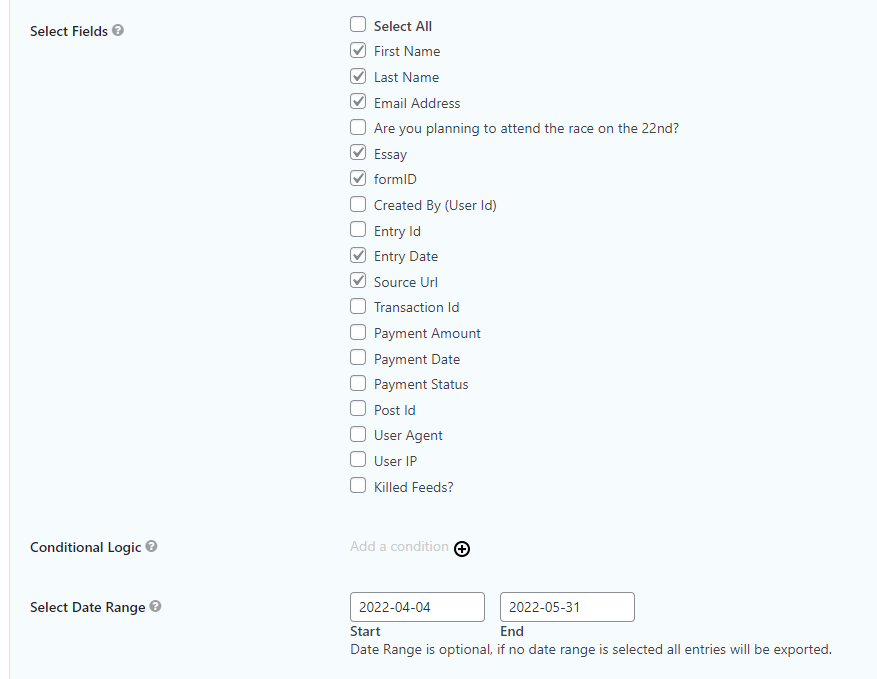
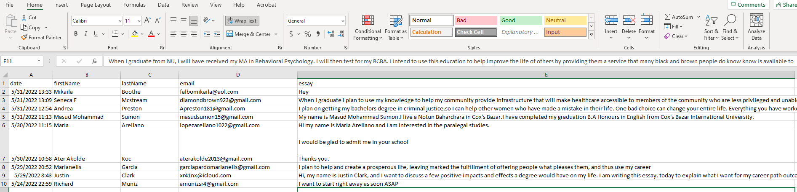

# Submitting to DataOPS

!> Old documentation. Keeping here for now in case we need to reference for some reason.

At the beginning of each month, scholarship essays need to be sent to DataOPS.

## Pulling submission

- Log in to [nu.edu](https://www.nu.edu/wp-admin), go to `Forms` and select the `Import/Export` option. At the moment of publishing this page, the form used for all the NU scholarship pages is the `Scholarship Essays` form (`ID - 86`).

- Select the form to export entries.

- There is no need to select all fields. The only ones needed are: `First Name`, `Last Name`, `Email Address`, `Essays`, `Entry Date`, and `Source URL`. You can also select a date range to avoid exporting submission from previous scholarships.

- Download the excel and ensure each column has the same headers as the screenshot. Headers need to be **camel case** as requested by Data OPS. Delete any rows/columns that aren’t in the screenshot.

##  Submitting Scholarships
- To submit to Data OPS please see [this documentation](https://www.ncu.edu/sites/default/files/Reporting%20Intake%20Form%20Job%20Aid.pdf). The option to select would be `Data Ops Work entry`.

- The main thing that needs to be filled is the subject, which can just be something along the lines of “XXXXXX Scholarship Submissions/Essays” and the month of the scholarship.

- Small description of the task should inserted as well.

- `Requested due date` is the date it’s being submitted.

- It isn’t compliance & regulatory related and there’s no real need to fill in any other fields, the title and description are pretty self-explanatory.

- Attach the file or files (you can submit full and reentry in the same request) and add request.

!> Make sure to include Jake (jsamson@ncu.edu), Amanda Savage (asavage2@nu.edu), and Ernie (eprukner@nu.edu) on ticket.

- You will receive a confirmation email and someone from dataops will review and you will be notified the task has been completed after a few days.

### NU Schorlaships Contact Info
For any questions or concerns related to NU Scholarships, please reach out to Jacob Samson (Jake) at jsamson@ncu.edu.
