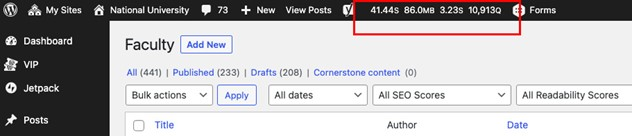

# Faculty Import

!> **Important**: The *only* updates we should make to Faculty post types via wp-admin is to add or change a headshot. Any other changes will be overwritten.

**If a faculty member is requesting an update (other than headshot) to their profile page on nu.edu, tell them they need to make the change in SOAR and the updates will auto-populate after about a week.**

Headshots can be manually added/changed via the standard 'featured image' functionality within a given Faculty post.

The content for Faculty post types is pulled automatically from SOAR, via an API. In order to update this, we need to manually hit the API endpoint once per week.

-----------------------------------------

### Running the Faculty Import Process
In order to run the faculty import process, visit the following URL: [https://www.nu.edu/wp-admin/edit.php?post_type=faculty&import-faculty=1](https://www.nu.edu/wp-admin/edit.php?post_type=faculty&import-faculty=1)

After the page loads (probably ~30 seconds or so), check the Query Monitor on the admin bar (screenshot below). If the number of queries is very large (close to or above 10,000), then the API response & faculty import was successful, and you're done. If the number if queries is significantly less than that, ping the URL again.

**Note**: This is a large API response and the SOAR API has a tendency to time-out. In order for the queries to fully populate, you may need to ping the URL 6-7 times.

**Schedule**: Our current practice is to run the import process weekly, on Tuesday morning. I don't believe there's anything special about this timing, I think it was just arbitrarily selected. We currently have a Slackbot notification setup in the #dev channel to remind us to do this, that way anyone who has the capacity to take care of it can do so. 

After running the process, please add a 'checkmark' :heavy_check_mark: reaction to the Slackbot message, so everyone else knows it's already been completed for the week.

-----------------------------------------
### Future Ideas
- Might be worth looking into automating this weekly process as a cron job
- For faculty that are no longer with NU, this process changes their post to 'Draft' status. Unclear if there's a reason we're doing this, rather than just deleting outright.