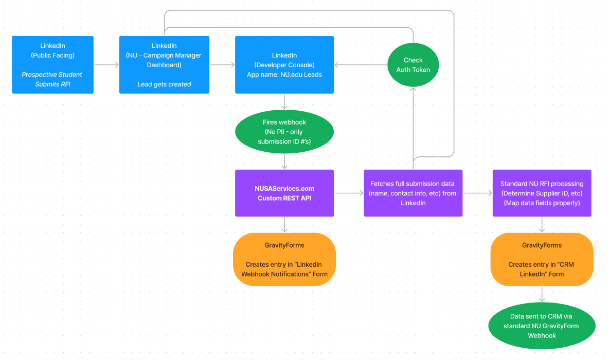

# LinkedIn Lead Gen 

**Context**: NU's Paid Media team uses social media channels (Facebook & LinkedIn) for lead generation. In order to get these leads into our CRM (Eloqua/DP/Sparkroom) for the NU Enrollment team to work them, we first pass them through a custom API we created on NUSAServices.com. We do this so that we can process additional information (supplier ID, UTMs, etc) and properly map the data to match required CRM fields. 

**Basic data/process flow**: 

1) Prospective student fills out RFI on LinkedIn
2) "Lead" gets created on NU's LinkedIn Campaign Manager (linkedin.com/campaignmanager)
3) NU's LinkedIn Developer Console App fires a webhook to our internal NUSAservices.com API. 
    - Note: This webhook does not contain personal information, only a series of ID numbers.
4) NUSAServices API creates a GravityForm entry for the "LinkedIn Webhook Notifications" Form, using the webhook data.
5) NUSAServices API sends a request to the LinkedIn Developer Console App to authorize our access token.
6) If the access token is active and authorized, we then send a request to the LinkedIn Campaign Manager App to fetch the full Lead information based on the ID #'s contained in the initial webhook (step 3).
7) After receiving the full lead info, NUSAServices API proceeds with our "standard RFI data processing" (determine supplier ID, UTM parameters, map data fields & formats, etc).
8) Create a new GravityForm entry in the "CRM Webhooks - LinkedIn" Form. This entry should essentially match our standard RFI entries that we collect on nu.edu and info.nu.
9) Form data is then sent to CRM (Eloqua/DP/Sparkroom) via standard webhook functionality we use everywhere else.

## Access Tokens

!> If Paid Media is reporting that LinkedIn Leads are not making it through to CRM, it's **probably** a bad Access Token (step #5 above)

In order for the above process to work (i.e. everything after step #5), we need to have a valid "Access Token" generated by the LinkedIn Developer Console. **These access tokens expire after 2 months and need to be regenerated.**

Token generation is handled via the wp-admin on NUSAServices.com. When a token is generated, it is stored within the WordPress database, and then used for all future LinkedIn API requests until it expires.

### How to Tell if Our Current Access Token has Expired

1) Via the WP-CLI: `vip@2801.production wp option get nusa_nu_linkedin_token`
 - This will return an array that contains a 'expires' value. This value is a unix timestamp that will need to be converted via a tool like https://www.epochconverter.com/
 - If the date is in the past, then our token is expired and we need to generate a new one.
 - Note: `2801.production` tells WPVIP we want to run the command on the `production` environment of nusaservices.com (which has a WPVIP app ID of `2801`).

2) Manually check & compare GravityForm entries via wp-admin
	- "Initial" entries are saved to the "**LinkedIn Webhook Notifications**" form on NUSAServices.
	- "Final" entries are saved to the "**CRM Webhooks - LinkedIn - NU**" form on NUSAServices.
	- If our access token is good, entries will match across both forms (compare '**Form Response ID**' values)
	- If our access token is expired, there will be extra entries in the "initial" form that are not present in the "final" form.

### How to Generate a New Access Token

**Prerequisites:**
- Need login credentials for an "authorized" LinkedIn account
	- Currently authorized: Dan & Kyle. Note that these are *personal accounts* that are granted access. We previously had a project in the works to transfer sole authorization to "Natalie Upton", a fake-name account created by the social media team for the purpose us not having this entire API process rely on a single dev's personal account. Alex had previously been working on this but it got put on hold with his departure.
- In order for an account to be "fully authorized":
	- Added to our "NU.edu Leads" app on the LinkedIn Developer Console (developer.linkedin.com -> Team Members)
	- Added to our NU Campaign Manager/Ad Account with 'Account Manager' capabilities (linkedin.com/campaignmanager)
	- Added to our Business page admin with 'Super Admin' capabilities (https://www.linkedin.com/school/210965/admin/) 

**New Access Token Process:**
1) Login to nusaservices.com/wp-admin
2) Navigate to Settings -> LinkedIn API
3) Select the "National University" menu tab
4) Do not change any of the inputs!
5) At the bottom of the page, click the "Request Authorization Code" button
6) Your browser should redirect you to a LinkedIn sign-on screen. Sign in with your authorized account.
7) If everything works, you should be redirected back to nusaservices.com with a JSON object of {status: true}
8) If you get anything other than {status: true}, token generation failed. Double-check prerequisites above and try again.

## Manually Pushing Leads to CRM

If our Access Token expires, initial webhook leads sent from LinkedIn will still make it into nusaservices.com but they will be unable to be processed and passed to CRM. This means that these leads are not "lost", only "stuck". Once we regenerate a new Access Token, we can manually push any stuck leads to our CRM.

**Process:**
1) Navigate to wp-admin Settings -> LinkedIn API
2) At the bottom of the page, click the "Fetch Responses" button
3) Select the date range that leads will need to be processed for (i.e. from the day our token expired thru today)
    - **NOTE** Processing takes awhile. If our access token has been expired for multiple days, probably a good idea to only run this for one or two days at a time, and then repeat until you catch up to the current day. Not sure if the API will time out.
4) If everything worked, you'll see a page telling you how many leads have been processed.
    - If you get an error, double check that: a) We're using an active access token, and b) The account used to generate the access token has the applicable authorization levels (see Access Token prerequisites, above)
5) Manually check & compare GravityForm entires
    - Form: LinkedIn Webhook Notifications, check 'state' field for list of entries. Successful entries should say 'Processed'. If any entries say 'New', then select them via checkbox and do Bulk Actions->Import Notifications

## LinkedIn API Versioning
We use the LinkedIn Marketing API for the above-discussed leadgen flow. As of February 2023, LinkedIn dropped support for their legacy API (v2) and transitioned to a new monthly-versioned API format. The major requirement for this is that **all requests to LinkedIn API endpoints must contain a "version" value in the request header**. This version needs to be in YYYYMM format, i.e. 202302.

Going forward, LinkedIn will release a new API version **every month**, however each monthly version will remain supported for at least a year. This means that at the very least we will need to revisit this once per year, but ideally we should update on a monthly basis if possible.

To help keep us up to date while minimizing the need for constant code releases, we can set the API version we want to use via WP-Admin, under the Linkedin API Settings->Config Settings. This should (ideally) be reviewed monthly, and assuming no breaking changes have been introduced, the version can be updated on our end. Version updates should be tested thoroughly on preprod (see below) prior to updating on production.

## Testing

### Testing on Preprod/Local
We have developed a tool for testing our Linkedin Leadflow: https://nusaservices-com-preprod.go-vip.net/linkedin-leadgen-test/

This is because it's impossible to test our leadflow accurately with dummy data, because we need to make an API call to LinkedIn that uses an actual adFormResponseID otherwise the request will fail.

To use this tool, click the "generate inputs" button at the bottom of the form. This will grab a random recent entry from our production site, and populate it into the form. Clicking submit will submit the data to the LinkedIn response endpoint, and debug logging will be displayed on the right side of the page. The important part of this output is the bottom "Compare to Output" table. The first row shows the result of the "test" API we just ran. The bottom row shows the actual data stored on production for the same entry. If the two lines match, then our code on preprod is working. There's a lot more work we could do to smooth out this testing tool, but for now it will still give us a high degree of confidence that any updates being tested on preprod will work on production.

### Testing on Production
Need to go to LinkedIn Campaign Manager, pull up an ad that has a leadgen form associated with it. From within CampaignManager, click 'Preview' and fill out and submit the form. Check produciton wp-admin. Should see an entry under Forms->Linkedin Webhooks Notifications (status: processed), and then a corresponding entry in the Forms->LinkedIn CRM Webhooks.

## Resources/References
- LinkedIn Developer Console: https://developer.linkedin.com
- LinkedIn Campaign Manager Dashboard: https://linkedin.com/campaignmanager
- LinkedIn NU School Page: https://www.linkedin.com/school/210965/admin/
- LI API Lead Gen Authorization Reference: https://www.linkedin.com/help/lms/answer/a421620/permissions-for-lead-gen-forms?lang=en
- LI Lead Gen Webhook reference: https://learn.microsoft.com/en-us/linkedin/marketing/integrations/lead-gen/ads-leadgen?view=li-lms-2022-09&tabs=http#lead-notification-content
- FB webhooks dev docs: https://developers.facebook.com/docs/graph-api/webhooks/ 
- FB app inside of FB developers dashboard: https://developers.facebook.com/apps/655915921954022/dashboard/?business_id=10152303787876404 

### Other Misc Notes
- The LinkedIn API Admin Settings page shows options for 'City University' and 'Northcentral University'. As a part of our once-planned transition to NEP, NU's webdev team was also responsible for Linkedin Leadgen for these two schools. However, this is no longer the case, and these have not been used for well over a year. This is a big reason why the code for NUSAServices is so complex, the processes were built to scale across multiple schools rather than just NU. Going forward we can delete these two schools from the wp-admin settings, and hopefully at some point simplify the codebase a bit.