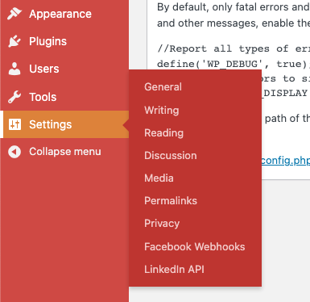
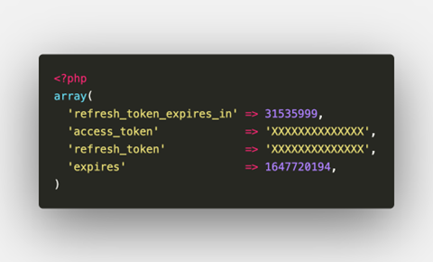

# LinkedIn Webhook Token Update Procedure 

The following is pasted from a document left on sharepoint from Mike Estrada.

---------------------------------------------------------------------

Subject matter: 

NU has (at the moment of publishing this document) webhook services in place for both Facebook and LinkedIn. FB does not need token/credentials update; therefore, this document solely focuses on LinkedIn. These webhooks act as “middle ground” and for hand-off between LinkedIn/FB and our CRMs (like Eloqua, DoublePositive, etc). These are specifically for LinkedIn Lead Gen Forms (LGFs) and FB lead ad forms. 

Our web dev team built custom plugins to integrate these webhooks (found in the resources section of this document). The following are instructions on how to update the token for LinkedIn since it expires every two months. The same token can be used for all our affiliates as a single “app”. 

### Steps for new token: 
- Log in to nusaservices.com. 
- Navigate to Settings -> LinkedIn API. 
- All settings are setup and fields are mapped, no need to edit them. 
- Select the “National University” tab. 
- Scroll down to the bottom and press the “Request Authorization Code” button. 
- A page with a JSON object response should appear and “true”. 
- Done. 

### Steps to copy token over to other affiliates 

The most convenient way to do this is to use the WP CLI tool to copy settings over since these are saved in the options table of the database, which there is no direct access to on WPVIP hosting. 
- Use the WP VIP CLI tool with the vip wp command. 
- Select the nusaservices app. 
- Select “production” environment. 
- Get the NU options: wp option get nusa_nu_linkedin_token which follows the format wp option get nusa_{uni_slug}_linkedin_token. 
- The result will be an array with the needed data. 
	- Specific data needed is “access_token”, “refresh_token”, and “expires” 
	- Both tokens are long strings 
	- Expires date is an Epoch Unix timestamp. 
- Commands to update the other affiliates options: 
	- wp option patch update nusa_ncu_linkedin_token access_token XXXXXXXXXXXXXXXXXxxxXXXxxxxXXxxxxxxxXXXX 
	- wp option patch update nusa_ncu_linkedin_token refresh_token XXXXXXXXXXXXXXXXXxxxXXXxxxxXXxxxxxxxXXXX 
	- wp option patch update nusa_{uni_slug}_linkedin_token expires 111111111 
	- uni_slug options include cityu, ncu, and nu. 
- Take note of the “expire” option and convert it online with a tool such as unixtimestamp.com so a calendar reminder can be set. 

### Resources 
- FB plugin repo (private): https://github.com/NationalUniversitySystem/fb-entries-webhook 
- FB webhooks dev docs: https://developers.facebook.com/docs/graph-api/webhooks/ 
- FB app inside of FB developers dashboard: https://developers.facebook.com/apps/655915921954022/dashboard/?business_id=10152303787876404 
- LinkedIn plugin repo (private): https://github.com/NationalUniversitySystem/linkedin-entries-webhook  
- LinkedIn webhooks dev docs: https://docs.microsoft.com/en-us/linkedin/shared/api-guide/webhook-validation  
- LinkedIn app inside developers dashboard: https://www.linkedin.com/developers/apps/70513486/settings 
- Epoch unix time converters: 
	- https://www.epochconverter.com/ 
	- https://www.unixtimestamp.com/ 
	- https://nusaservices.com 

Location of settings in the admin dashboard: 

Example of settings when pulled by WP CLI: 

