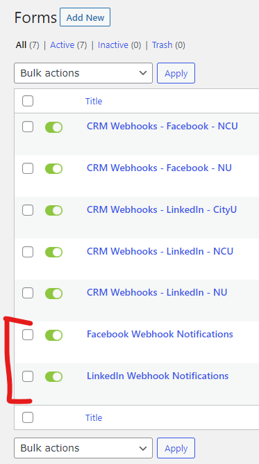
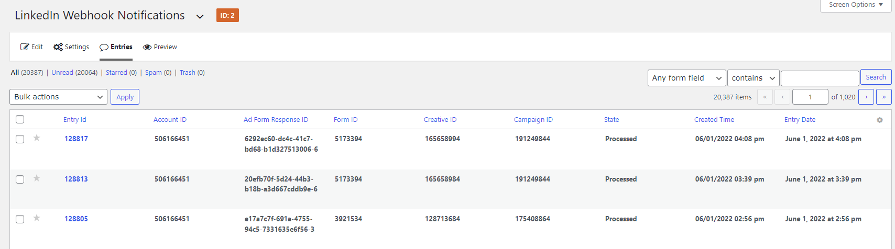
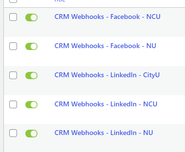
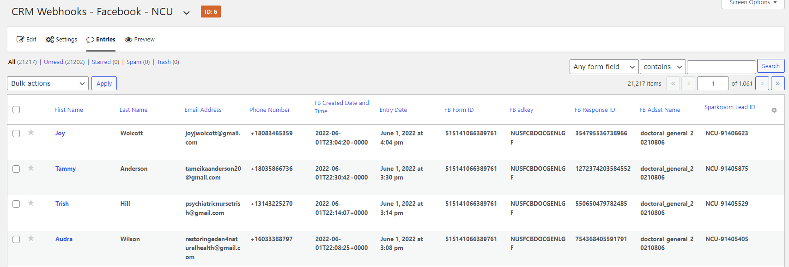

# NUSAServices.com

!> The below is info left behind from Mike & Alex and may be outdated at this point. For additional info, please see: [NU Site Documentation - LinkedIn LeadGen](nu-site-doc/linkedin-lead-gen.md)

The reason that this site exists is for LinkedIn and Facebook (Meta) to send the Lead Gen Form entries from the [LinkedIn.com](http://linkedin.com/) or [Facebook](https://www.facebook.com/) ads itself to a [nusaservices.com](http://nusaservices.com/) endpoint/webhook and then that website sends it to the CRM via GravityForms webhooks.

The web team was asked to build this site because before it was developed, the Paid Media team used to use Zappier but they needed some data manipulated or predetermined (supplier ID and such) before it went to the CRM...all of which LinkedIn nor Zappier offer.

### How nusaservices.com works?
- Someone on LinkedIn or Facebook submits a Lead Gen Form type of ad on LinkedIn/FB.

- LinkedIn/FB sends a notice to the [nusaservices.com](http://nusaservices.com/) website which is caught at specific URL for each.

- The code on the `nusaservices` side imports that information into one of [those GravityForms at the bottom](https://www.nusaservices.com/wp-admin/admin.php?page=gf_edit_forms) as an entry (it doesn't have any name, email, etc..just `Entry ID`, `formID`, `page ID`, `state/status`, and stuff like that).

- The code on the website uses that data to ping LinkedIn/FB back again with that information and the saved token(s) to get the actual name, email, program, etc.

- Catch that information and save it into those forms that start with `CRM Webhooks XXXXX`

- The site runs custom code for `SupplierID` and all that.

- Run whatever is in the `webhooks` part of the settings for Gravityforms of that specific form (sparkroom/doublepositive) to send all data to the CRM.

!> Important: at the moment of publishing this page, the Paid Media team is not running **LinkedIn** ads for **NCU** and **CityU**
