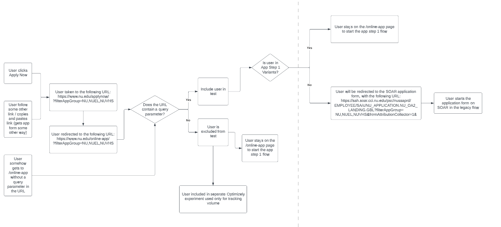
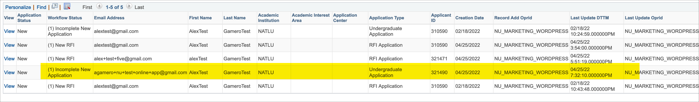
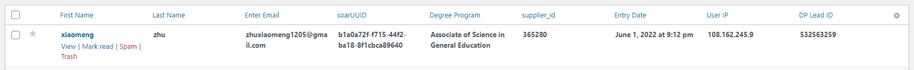
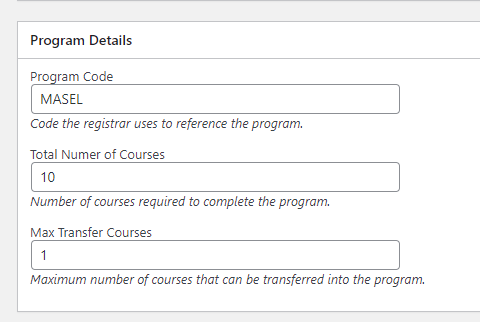
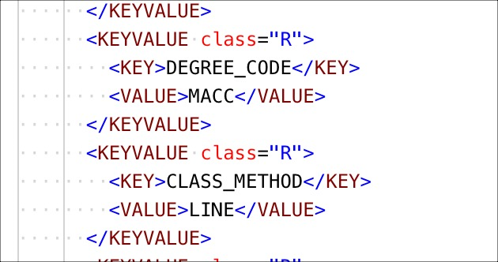

# App Step 1 RFI (Online App RFI)

This form currently lives on [nu.edu/online-app](https://www.nu.edu/online-app/).

Here is a quick diagram of how this logic/pathing works:


- At the moment of publishing this page, there is a redirect set up to send all traffic from `https://www.nu.edu/applynow/?filterAppGroup=NU,NUEL,NUVHS` to `https://www.nu.edu/online-app/?filterAppGroup=NU,NUEL,NUVHS`. This means all `Apply Now` buttons across the site are sending visitors to the [Online App page](https://www.nu.edu/online-app/).

- In Gravity Forms, the `Online App` form is the `RFI - Apply Now (ID 56)` (https://www.nu.edu/wp-admin/admin.php?page=gf_edit_forms&id=56)

- There are three webhooks in place for this form (Eloqua, DoublePositive, and SOAR). A lot of tests have been done in the last few months to make sure all submissions successfully make it over to SOAR and DoublePositive.

- When a user submit the `Online App` form, a new entry is created in [WP](https://www.nu.edu/wp-admin/admin.php?page=gf_entries&id=56), a new application is created in SOAR (screenshot below), and a new entry is created in DoublePositive.



- To confirm a successful submission in WP, it needs to have a `soarUUID`, `supplier_id`, and `DP Lead ID`.



- If there is an issue with submissions and they are not making it over to SOAR (not `soarUUID` in WP), you are able to manually send unsuccessful submissions to SOAR. Please refer to [this doc page](https://nationaluniversitysystem.github.io/dev-knowledge-hub/#/nu-site-doc/soar-application?id=e-send-unsuccessful-submissions-to-soar) where all steps are detailed.

## Program/Degree Codes
This application sends SOAR program codes based on the programs the students selects. All NU programs have a program code. This allows SOAR to assign the correct values. All Programs CPT have a `Program Details` custom metabox with three custom fields. For example, the Master of Arts in Social Emotional Learning is sent with the `Program Code` of `MASEL`.



In SOAR, these codes are sent over in the XML as a `KEY VALUE` pair with the `KEY` of `DEGREE_CODE`.



These code are important so make sure to keep them up to date.

!> When creating a new program, make sure it has a program code assigned. For questions about this code, please reach out to Brett Schultz (bschultz@nu.edu).

Todd from the Brick Factory created [this Google Sheet](https://docs.google.com/spreadsheets/d/1z4v83PXp_XgD9ELsecNLgPrA7o-ons0bSxBsPFfoqq0/edit#gid=0) with two tabs:
- `ProgramList` - This is a list of programs on the NU website with relevant taxonomy data. Please reference the "Appears in RFI" column to see whether the program is in the list on the RFI forms.
- `ProgramCode` - This is the list of program codes used to power step one of the application on the website.

### Export Program Codes
Getting a list of program codes can be done using [WP CLI](https://wp-cli.org/):
```
vip @1161.production -- wp post list --post_type=program --posts_per_page=500 --meta_key=program --fields=title,program,url --format=csv
```

## Useful Links
For more details, please have a look to the [`nuedu-core-functionality plugin`](https://github.com/wpcomvip/nu-edu/tree/master/plugins/nuedu-core-functionality). [SOAR Integration setup](https://github.com/wpcomvip/nu-edu/tree/master/plugins/nuedu-core-functionality/inc/soar)

!> When testing the App Step 1 form bear in mind that `preprod` and `production` are not synced so testing results may vary depending on the environment where doing the test. Also, do not use the same email address when submitting the form (e.g. test@test.com). Using the same email address won't create a new application in SOAR.

## Contact Info
- Parker Sorensen - Sr. Manager, Conversion Optimization: psorensen@nu.edu
- Brett Schultz - CWR - Independent Contractor Information Technology: bschultz@nu.edu (anything related to SOAR)
- Claire Leong - AD, Enroll Proc Opt & Enable: cleong@nu.edu (anything related to DoublePositive)
