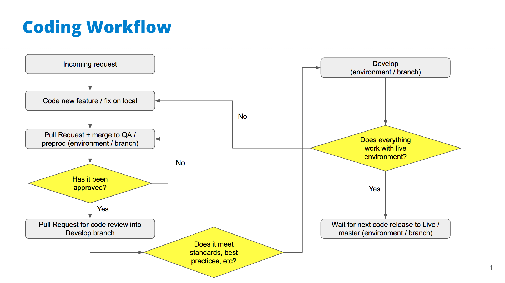

# Development Workflow

The following guide will be geared towards nu.edu, but all of our affiliate sites essentially follow this as well.

Our codebase is managed via GitHub -- https://github.com/wpcomvip/nu-edu

## Dev Environments

For nu.edu, in addition to our live site, we have two development environments:
- DEVELOP: https://nu-edu-develop.go-vip.co/
- PREPROD: https://nu-edu-preprod.go-vip.co/

Each environment is its own standalone site, with its own codebase and its own database.

- Each env has it's own 'branch' in our repo
- Technically two branches, preprod & preprod-built
	- This is because of our build process
	- `preprod`, `develop` and `master` are what we create pull requests towards
	- `preprod-built`, `develop-built`, and `master-built` are what are actually shown on the live site
	- GitHub actions + CircleCI for build process [expand more on this, maybe in a different section]

Important! Preprod is a standalone QA/test environment, while Devlop is our staging server before going live. This naming convention/workflow is a bit different than what most companies use. This is something that was set up a long time ago, and at this point it would be far more trouble than it's worth to try and change the naming conventions.

Preprod ("preprod" branch) -- QA/initial testing
Develop ("develop" branch) -- Staging server.
Production ("master" branch) -- Live site

## Standard Workflow

1) Project Request comes in
2) Create new git branch based off `develop` branch (link to feature branch naming convention)
3) Develop & test locally. Commit early, commit often.
4) Once it's good locally: Create pull request for your branch into `preprod` branch
	- Code review to ensure "best practice" standards, and no clashes with other code
5) Once preprod build process has run, check preprod site for testing/QA
	- Make any database (wp-admin) changes to preprod site.
	- While ideally our local dev environment will match our live server environments, it's not always 100% and sometimes issues will come up on the live server. Since our hosting & environments are all managed by WPVIP, this where all of our testing/QA takes place.
	- If external review/approval is needed from other NU teams, send them the preprod link so they can test/review
6) Apply any necessary changes/revisions, and re-push to `preprod` branch, re-review as necessary
7) Once the preprod version is approved, go back to your feature branch and create a new pull request to merge into `develop`
	- Commits may need to be squashed
8) Once branch is merged into develop, do one final round of QA/testing on develop site.
	- Make any database (wp-admin) changes to develop site
9) During our next scheduled code release, the `develop` branch (which at this point likely includes multiple new 'feature' branches that have gone through the above workflow) will be merged into the `master` branch.
10) Perform one final test on the live site to ensure everything is good.
	- Make any database (wp-admin) changes to live site

----------------------------------------------------------------------

?> _TODO_ Below content is from prior dev documentation, may be outdated.

----------------------------------------------------------------------

We use Github to track and host our projects through WPVIP.

All our work gets done locally first, then **merged** into the `preprod` branch for environment QA and for sending links for approval.

This also applies to content updates, please update on the QA/`preprod` site first and submit for approval the appropriate contacts.

Once the coding feature or change is complete and approved, create a Pull Request on Github towards the `develop` branch, then assign the project lead for a code review and merge approval.

The workflow is broken down further below.

## Branch Naming Convention
Branch naming convention includes folders to keep our branches as organized as possible:
- `plugins/{plugin-name-slug-folder}/{feature-or-fix-name}` for plugin development
- `plugins/{plugin-name-slug-folder}` for 3rd party plugin updates
- `themes/{specific-theme-slug}/{feature-name}` for developing a feature which will specifically apply to one theme
- `themes/{feature-name-for-all-themes}` for developing a fix/feature that will apply to all the sites' themes

## Workflow
- There are typical three main branches in our projects (`develop`, `preprod`, and `master`) representing each environment, `master` representing the live/production environment.
- Never do Pull Requests/merges to the `master` branch from a feature branch (only reverting code or emergency fixes).
- Do not commit the files in the assets folder. These will be built on merge for each environment branch.
---
- To start work on a new features request, branch off of `develop` ([naming convention above](#branch-naming-convention)).
- Test functionality locally.
- Commit all work to feature branch (commit early, commit often, do not push up to remote/origin).
- Push branch to remote/origin once it works locally.
- If code is to be reviewed by client:
  - Our QA/testing environment is our `preprod` and will need to branch onto from develop.
  - This is important to not take extra commits or features to the `preprod` branch that are not part of what you're currently working on.
  - `--onto` is sometimes complicated so ask for help if needed or confused.
  - `git rebase --interactive --onto {branch name or hash of where you want to go} {originally where you branched off} {the branch you're moving (optional)}`
  - In Github, do a pull request from feature branch to merge into `preprod` for QA/revision, or `develop` if it is ready for peer review and the live site.
- If code is ready for review by dev team the PR can be done towards `develop`.
  - Examples can be simple style changes, single line JS changes, etc.
  - The PR reviewer should be able to check the changes on their local instead of needing a full environment like `preprod`.
- Pull Request should include a description of what the merge will affect (repos should have templates for PRs).
- Assign the project lead as a reviewer.
- Add labels if applicable (at least a priority label).
  - **Priority 1** - High priority - Should be released ASAP (e.g. bug fixes).
  - **Priority 2** - Mid-level priority - Should be released at earlies convenience.
  - **Priority 3** - Low priority - Does not need to be released at the moment.
- Fix any review comments or automated checks that appear in the comments.
- Await reviewers' approval for merge.
- Check work on environment (`preprod` or `develop`).
- Await next code release. Once code is on the live site, check the pages/code affected and mark work for approval one final time in project management system.

Flowchart for visual aid:

