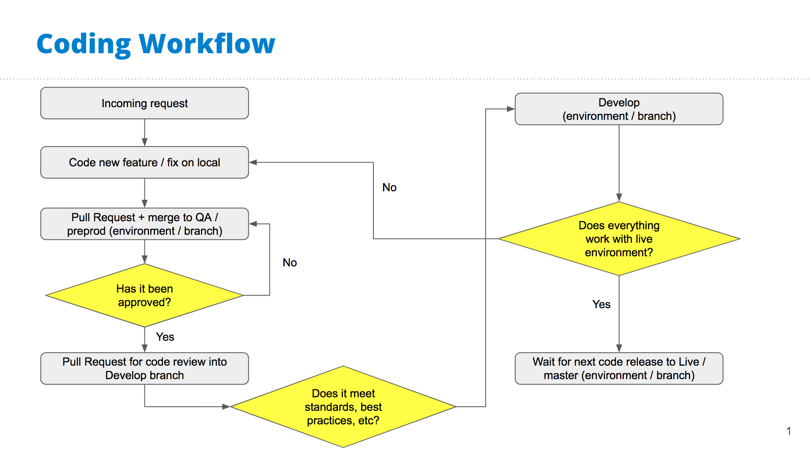

# WPVIP Contributing and Development Guide

We use Github to track and host our projects through WPVIP.

All our work gets done locally first, then **merged** into the `preprod` branch for environment QA and for sending links for approval.

This also applies to content updates, please update on the QA/`preprod` site first and submit for approval the appropriate contacts.

Once the coding feature or change is complete and approved, create a Pull Request on Github towards the `develop` branch, then assign the project lead for a code review and merge approval.

The workflow is broken down further below.

## Branch Naming Convention
Branch naming convention includes folders to keep our branches as organized as possible:
- `plugins/{plugin-name-slug-folder}/{feature-or-fix-name}` for plugin development
- `plugins/{plugin-name-slug-folder}` for 3rd party plugin updates
- `themes/{specific-theme-slug}/{feature-name}` for developing a feature which will specifically apply to one theme
- `themes/{feature-name-for-all-themes}` for developing a fix/feature that will apply to all the sites' themes

## Workflow
- Set up local environment for WPVIP development.
  - [WPVIP's guide to setup local environment](https://docs.wpvip.com/how-tos/local-development/)
  - [Our team's code standards](https://github.com/NationalUniversitySystem/nusa-code-standards). "All code in any code-base should look like a single person typed it, no matter how many people contributed".
- There are typical three main branches in our projects (`develop`, `preprod`, and `master`) representing each environment, `master` representing the live/production environment.
- Never do Pull Requests/merges to the `master` branch from a feature branch (only reverting code or emergency fixes).
- Do not commit the files in the assets folder. These will be built on merge for each environment branch.
---
- To start work on a new features request, branch off of `develop` ([naming convention above](#branch-naming-convention)).
- Test functionality locally.
- Commit all work to feature branch (commit early, commit often, do not push up to remote/origin).
- Push branch to remote/origin once it works locally.
- If code is to be reviewed by client:
  - Our QA/testing environment is our `preprod` and will need to branch onto from develop.
  - This is important to not take extra commits or features to the `preprod` branch that are not part of what you're currently working on.
  - `--onto` is sometimes complicated so ask for help if needed or confused.
  - `git rebase --interactive --onto {branch name or hash of where you want to go} {originally where you branched off} {the branch you're moving (optional)}`
  - In Github, do a pull request from feature branch to merge into `preprod` for QA/revision, or `develop` if it is ready for peer review and the live site.
- If code is ready for review by dev team the PR can be done towards `develop`.
  - Examples can be simple style changes, single line JS changes, etc.
  - The PR reviewer should be able to check the changes on their local instead of needing a full environment like `preprod`.
- Pull Request should include a description of what the merge will affect (repos should have templates for PRs).
- Assign the project lead as a reviewer.
- Add labels if applicable (at least a priority label).
  - **Priority 1** - High priority - Should be released ASAP (e.g. bug fixes).
  - **Priority 2** - Mid-level priority - Should be released at earlies convenience.
  - **Priority 3** - Low priority - Does not need to be released at the moment.
- Fix any review comments or automated checks that appear in the comments.
- Await reviewers' approval for merge.
- Check work on environment (`preprod` or `develop`).
- Await next code release. Once code is on the live site, check the pages/code affected and mark work for approval one final time in project management system.

Flowchart for visual aid:

